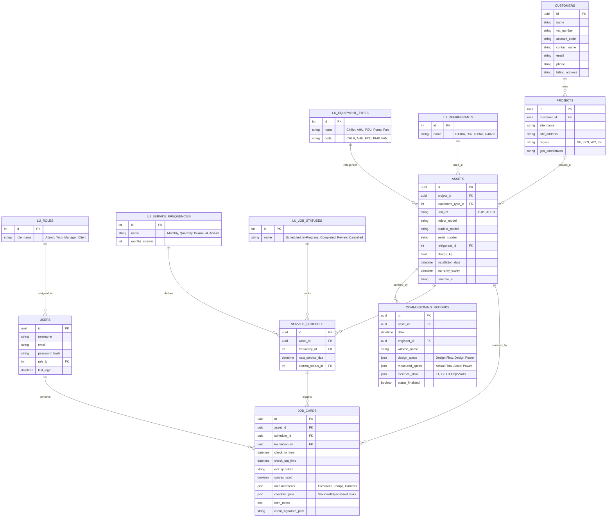

# HVAC Asset Pro - Detailed Database Design Sketch

This document outlines the professional-grade database architecture for the Asset Management System, including detailed lookups and technical specifications required for CIBSE and ASHRAE compliance.

## Detailed Entity Relationship Diagram (ERD)

## Key Design Enhancements

1.  **Lookup Integrity**: By moving types (Refrigerants, Equipment Types, Frequencies) into dedicated lookup tables, we ensure data consistency and allow for easy global updates or translations.
2.  **Granular Assets**: The `ASSETS` table now includes barcode tracking, warranty dates, and specific refrigerant charge fields, making it a true "Digital Twin" of the physical unit.
3.  **Audit-Ready Job Cards**: `JOB_CARDS` now track precise `check_in_time` and `check_out_time`, combined with the `exit_qr_token` for undeniable proof of service duration and location.
4.  **Service Lifecycle**: The `SERVICE_SCHEDULE` acts as a bridge between the Asset and the Job Card, allowing the system to automate future maintenance dates based on the `LU_SERVICE_FREQUENCIES`.
5.  **Multi-Dimensional Measurements**: Both Commissioning and Job Cards use `json` types for measurements, providing the flexibility to store high-precision data (e.g., individual phase currents or multi-stage pressure readings) without schema bloat.
6.  **Regional Management**: Projects include a `region` and `gps_coordinates` to assist in technician dispatching and regional reporting.
