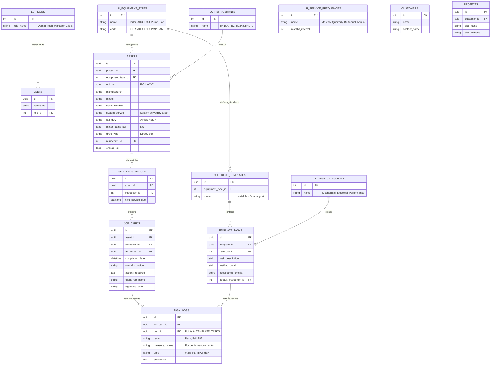

# HVAC Asset Pro - Detailed Database Design Sketch (ASHRAE 180 Compliant)

This document outlines the professional-grade database architecture for the Asset Management System, incorporating detailed **ASHRAE 180** standards for Axial Flow Fans and other equipment.

## Detailed Entity Relationship Diagram (ERD)

## ASHRAE 180 Specific Integration

Based on the **Axial Flow Fan** requirements, the design now handles:

1.  **Detailed Asset Specifications**:
    *   Fields for `system_served`, `fan_duty`, `motor_rating_kw`, and `drive_type` are added to the `ASSETS` table to match the image requirements.
2.  **Structured Task Hierarchy**:
    *   Tasks are split into categories (Mechanical, Electrical, Performance) via `LU_TASK_CATEGORIES`.
    *   `TEMPLATE_TASKS` stores the `Method/Detail` and `Acceptance Criteria` directly, ensuring technicians always know the standard they are testing against.
3.  **Performance Verification (ASHRAE 180 Section)**:
    *   `TASK_LOGS` handles the "Measured Value" and "Units" for critical ASHRAE checks like Airflow (m3/s), External Static Pressure (Pa), Fan Speed (RPM), and Noise/Vibration.
4.  **Compliance Audit Trail**:
    *   By linking `TASK_LOGS` back to `TEMPLATE_TASKS`, the system can generate a PDF report that looks exactly like the Excel spreadsheet provided, including the specific acceptance criteria and frequency for every single line item.
5.  **Sign-off & Actions**:
    *   The `JOB_CARDS` table captures the `Overall Condition`, `Actions Required`, and both the Technician and `Client Rep` names for full accountability.
