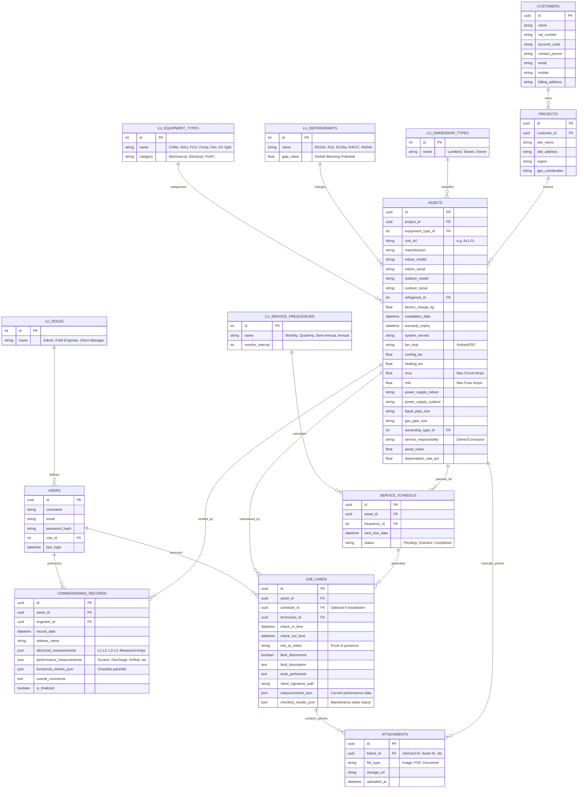

# HVAC Asset Pro - Comprehensive Database Architecture

This document outlines the professional-grade database architecture for the HVAC management tool, specifically rechecked against the system's current functional requirements (Commissioning, Technical Data Sheets, and ASHRAE 180 Maintenance).

## Detailed Entity Relationship Diagram (ERD)

## System Alignment Summary

This detailed design is specifically tailored to the features already present in the UI:

1.  **Technical Data Sheet Support**: The `ASSETS` table now includes all 20+ specialized fields found in the "Technical Data Sheet" stepper, including electrical ratings (MCA/MFA), piping sizes, and financial depreciation.
2.  **ASHRAE 180 Compliance**: The `TASK_LOGS` logic is integrated into `JOB_CARDS` via `checklist_results_json`, allowing the system to store specific results for Mechanical, Electrical, and Performance tasks as defined in the ASHRAE Axial Fan maintenance image.
3.  **Commissioning Performance**: The `COMMISSIONING_RECORDS` table is structured to handle the specialized data found in the Commissioning Form (L1-L2-L3 voltages, suction/discharge pressures, and calculated flow rates).
4.  **Verification Loop**: Proof-of-presence is enforced via `check_in_time`, `check_out_time`, and the `exit_qr_token` in the `JOB_CARDS` table.
5.  **Multi-Asset Photos**: The `ATTACHMENTS` table allows technicians to upload "Fault Pictures" as seen in the Service Entry form, keeping the main data tables lightweight.
6.  **Normalization & Scalability**: By using UUIDs and comprehensive Lookup tables, the system is ready to scale from a single site to a global enterprise asset registry.
