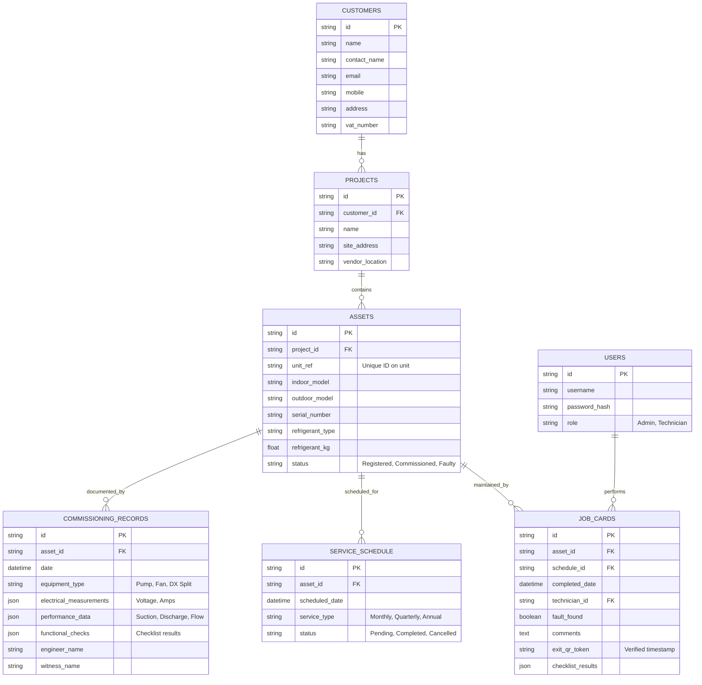

# HVAC Asset Pro - Database Design Sketch

This document outlines the proposed database architecture for the Asset Management System. It follows a relational structure optimized for equipment lifecycle tracking and dynamic technical data logging.

## Entity Relationship Diagram (ERD)

## Key Design Principles

1.  **Hierarchical Core**: The system follows a standard **Client > Site (Project) > Asset** hierarchy. This ensures scalability for clients with multiple geographic locations.
2.  **Asset-Centric History**: Every maintenance action (Commissioning, Scheduling, Job Cards) is linked directly to the `ASSETS` table. This enables a complete audit trail for each unit.
3.  **Dynamic Schemas (JSON)**: `COMMISSIONING_RECORDS` and `JOB_CARDS` utilize JSON columns to handle polymorphic technical data. This allows the system to store Pump measurements and Fan measurements in the same table without rigid schemas.
4.  **Verification Loop**: The `exit_qr_token` in `JOB_CARDS` provides proof-of-presence, ensuring technicians were physically at the asset during the service.
5.  **Analytics Ready**: Storing measurements as structured data allows for future predictive maintenance analytics and equipment performance reporting.
