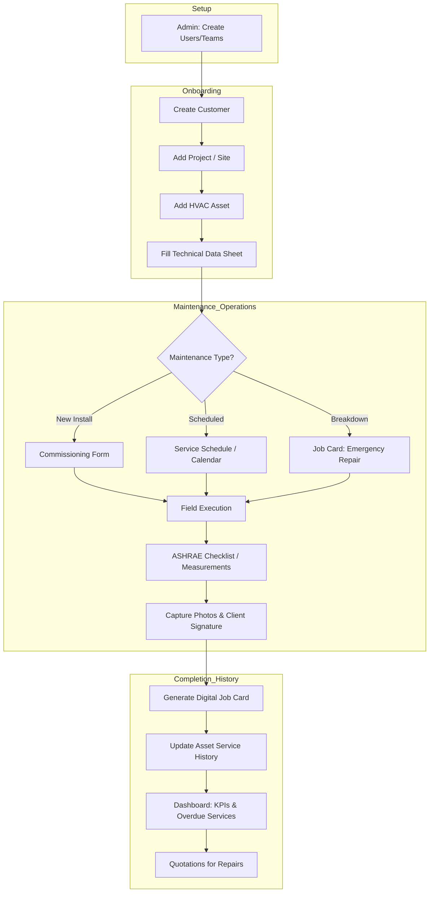

# HVAC Asset Pro - Detailed Process Flow

This document describes the end-to-end workflow of the HVAC Asset Management System, from initial setup to long-term maintenance and reporting.

## Process Flow Diagram

## Detailed Stage Descriptions

### 1. Setup & Administration
*   **User & Team Management**: Administrators define roles (Admin, Field Engineer, Client Manager) and organize technicians into teams based on expertise or region.

### 2. Onboarding (Inventory Building)
*   **Site Hierarchy**: Establishing the Customer -> Project (Site) -> Asset relationship.
*   **Technical Data Sheet (TDS)**: Capturing critical engineering specifications (MCA, MFA, pipe sizes, serial numbers) for every unit. This serves as the "source of truth" for all future maintenance.

### 3. Maintenance Operations
*   **Service Scheduling**: The system uses configured frequencies to automatically flag assets due for maintenance on the Service Calendar.
*   **Field Execution**:
    *   **Commissioning**: Specialized validation for new installations (Voltage, Amperage, Pressure).
    *   **Job Cards**: Digital forms for recording work performed, faults found, and capturing proof-of-presence.
    *   **Compliance**: Performance measurements are checked against ASHRAE 180 standards.

### 4. History & Reporting
*   **Asset Lifecycle**: Every job card and commissioning record is linked back to the asset, creating a complete audit trail.
*   **Actionable Insights**: The dashboard highlights overdue services and high-failure assets, while the Quotation module allows for quick conversion of discovered faults into repair orders.
